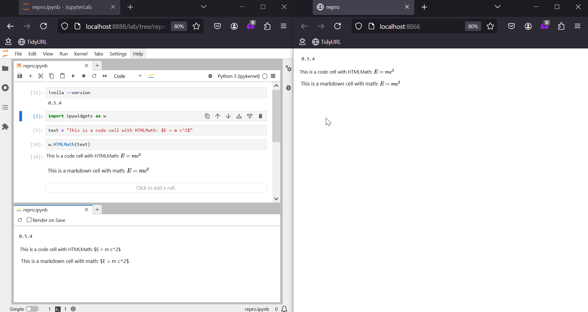
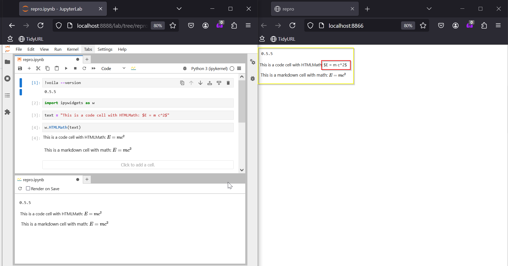

```
python -m venv .venv-0.5.4
# activate venv 
python -m pip install voila==0.5.4 ipywidgets jupyterlab
voila repro.ipynb
```




```
python -m venv .venv-0.5.5
# activate venv 
python -m pip install voila==0.5.5 ipywidgets jupyterlab
voila repro.ipynb
```

